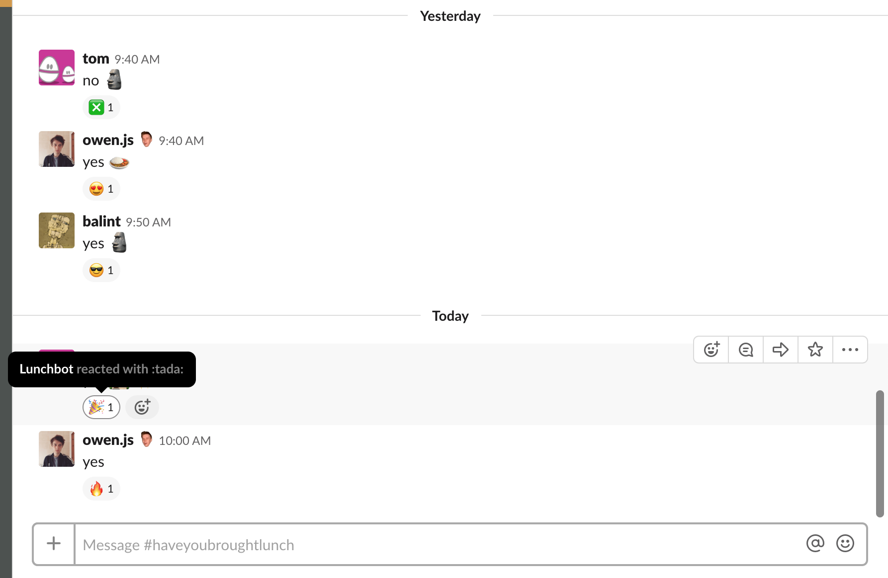
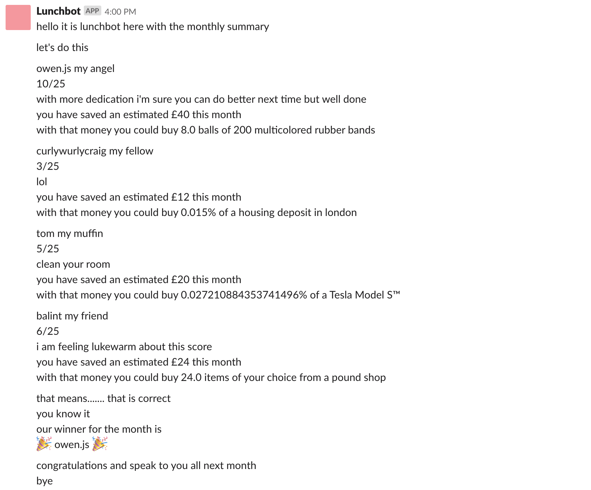

# Lunchbot

Lunchbot is a Slack bot to help you keep track of your lunchtime spending habits.
 
## How does it work?
 
The bot listens to all messages in the channels it belongs to. (TODO: the "all channels it belongs to" part is not actually true yet, but it's planned.)

Each work day, everybody who wants to take part in the game reports whether they brought food from home that day.



At the end of the month, the bot reports how much everyone saved in a thoughtful and friendly (but also quite judgemental and damning) way.



## For developers

### Getting started

You need these prerequisite tools installed.

* Python 3.7 (if you want to run tests/code locally)
* Node (for Serverless Framework: tested with v10.15.1 at time of writing)
* Yarn (also for Serverless Framework: tested with v1.13.0 at time of writing)

Create a virtualenv and install Python packages in there.

```
python -m venv venv
. venv/bin/activate
pip install -r requirements.txt
```

Install the Serverless Framework and its plugins.

```
yarn
```

### Running unit tests

Unit tests are written for pytest. It's already installed as part of requirements. Run this from inside the venv in your shell.

```
pytest lunchbot
```

### Setting up the Slack app from scratch

TODO: This section needs work. I started out quite manually before migrating to Serverless Framework. I've started trying to recall the steps, but there are missing parts.

1. [Create a new Slack app](https://api.slack.com/apps).
2. Turn on Bot and Event API features.
3. Complete the [Events API security challenge](https://api.slack.com/events-api#begin).

Step 3 is tricky. There's a chicken/egg problem: you need to point Slack to your API (deployed at a fixed URL) to receive the challenge, but your API needs config from Slack. To get around this, first deploy a dummy version of the API.

First, make sure you've got a domain name and TLS cert for that domain. (TODO: make the custom domain configurable at deploy time)

Temporarily replace the `on_slack_event` function in `handlers.py` with something like this.


```python
def on_slack_event(event, _context):
    """Lambda handler called when a new event from Slack is POSTed."""

    print("Received event from Slack.")
    print(event)

    return {
        "statusCode": 200,
        "body": json.dumps({"message": "Successfully processed Slack event."}),
    }
```

Then deploy the API to Lambda/API Gateway, behind your custom domain.

```
yarn sls deploy
```

From here you can follow Slack's instructions to complete the challenge. The endpoint URL you give to slack will look like this:

```
lunchbot.example.com/events
```

Add the file `env.yml` based on the template `env.example.yml`. These secrets configure the app's connection to a Slack workspace.

(TODO: add further info on how to get a Slack API token. Also unclear when to actually create the config file if custom domain is going to be configurable)
